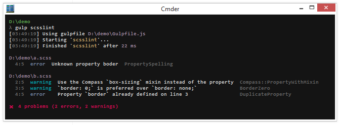

Stylish reporter for gulp-scss-lint, following the visual style of ESLint stylish reporter

<!--[](https://david-dm.org/jsek/gulp-scss-lint-stylish2) -->
[](https://github.com/jsek/gulp-scss-lint-stylish2/blob/master/LICENSE)
[](https://npmjs.org/package/gulp-scss-lint-stylish2) 
[](https://npmjs.org/package/gulp-scss-lint-stylish2) 

* [Overview](#overview)
* [Installation](#installation)
* [Usage](#usage)

## Overview

Example console output:



## Installation

```
npm install --save gulp-scss-lint-stylish
```

## Usage

``` javascript
var gulp      = require('gulp'),
    scssLint  = require('gulp-scss-lint'),
    reporters = require('gulp-scss-lint-stylish2');
 
gulp.task('scss-lint', function()
{
    gulp.src('/scss/*.scss')
        .pipe( scssLint({ customReport: reporters.suppress }) )
        .pipe( reporters.stylish() );
});

```

Alternative usage for errors:

``` javascript
    gulp.src('/scss/*.scss')
        .pipe( scssLint({ customReport: reporters.suppress }) )
        .pipe( reporters.stylish(errorsOnly: true) );
```
